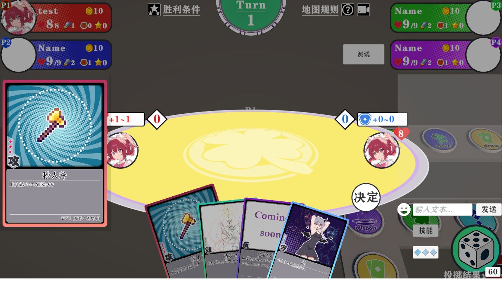

【Legend Clover】- 基于Unity6的桌游Demo

📖 项目简介
本项目基于unity6引擎，使用Mirror库制作了类 100% Orange juice/星引擎party 的卡牌桌游，实现了简单的联机功能和较为完整的游戏功能。但仍处于尚待完善阶段。

🖼️ 项目截图

*游戏的主界面，提供服务器连接与本地游戏(未实现)*

*角色选择界面，实现左右滚动及选角重复检测*

*游戏内通过骰子移动，在岔路可以选择*

*战斗界面，使用卡牌扩大你的攻守优势(结算未实现)*

🛠️ 技术栈
游戏引擎: Unity 6000.0.43f1
编程语言: C#
开发环境: Visual Studio 2022

🚀 如何使用
1.安装 Unity Hub
2.通过Unity Hub安装 Unity 6000.0.43f1 版本
3.克隆与打开项目
4.使用 Unity Hub 打开项目文件夹
5.导出Server版本与Client版本

📄 其他申明
项目处于Demo阶段，仅供学习交流，如有问题欢迎联系指出。
字体文件另附。
